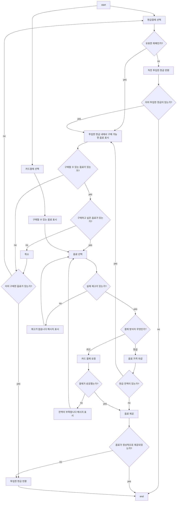

# Vending Machine

## Flowchart

```mermaid
flowchart TD
    start --> cash["현금결제 선택"]
    cash --> detectValidCash{"유효한 화폐인가?"}
    detectValidCash -- yes --> showPurchasableDrink["투입한 현금 내에서 구매 가능한 음료 표시"]
    detectValidCash -- no --> returnPreviousCash["직전 투입한 현금 반환"]
    returnPreviousCash --> hasCash{"이미 투입한 현금이 있는가?"}
    hasCash -- yes --> showPurchasableDrink
    hasCash -- no --> e["end"]

    showPurchasableDrink --> hasPurchasableDrink{"구매할 수 있는 음료가 있는가?"}
    hasPurchasableDrink -- yes --> hasWantedDrink{"구매하고 싶은 음료가 있는가?"}
    hasWantedDrink -- yes --> selectDrink["음료 선택"]
    hasWantedDrink -- no --> cancel["취소"]
    cancel --> alreadyHaveDrink{"이미 구매한 음료가 있는가?"}
    selectDrink --> hasStock{"실제 재고가 있는가?"}
    hasStock -- yes --> paymentMethod{"결제 방식이 무엇인가?"}
    hasStock -- no --> showStockError["재고가 없습니다 메시지 표시"]
    showStockError --> selectDrink

    paymentMethod -- 현금 --> deductDrinkPrice["음료 가격 차감"]
    deductDrinkPrice --> hasCashRemaining{"현금 잔액이 있는가?"}
    hasCashRemaining -- yes --> showPurchasableDrink
    hasPurchasableDrink -- no --> alreadyHaveDrink
    alreadyHaveDrink -- no --> cash
    alreadyHaveDrink -- yes --> returnAllCash
    hasCashRemaining -- no --> dispenseDrink["음료 제공"]
    
    start --> card["카드결제 선택"]
    card --> showAvailableDrink["구매할 수 있는 음료 표시"]
    showAvailableDrink --> selectDrink
    paymentMethod -- 카드 --> payment["카드 결제 요청"]
    payment --> isPaymentSuccess{"결제가 성공했는가?"}
    isPaymentSuccess -- yes --> dispenseDrink
    isPaymentSuccess -- no --> showPaymentError["잔액이 부족합니다 메시지 표시"]
    showPaymentError --> selectDrink

    dispenseDrink --> isOutputSuccess{"음료가 정상적으로 제공되었는가?"}
    isOutputSuccess -- yes --> e
    isOutputSuccess -- no --> returnAllCash
    
    returnAllCash["투입한 현금 반환"] --> e
```
 
