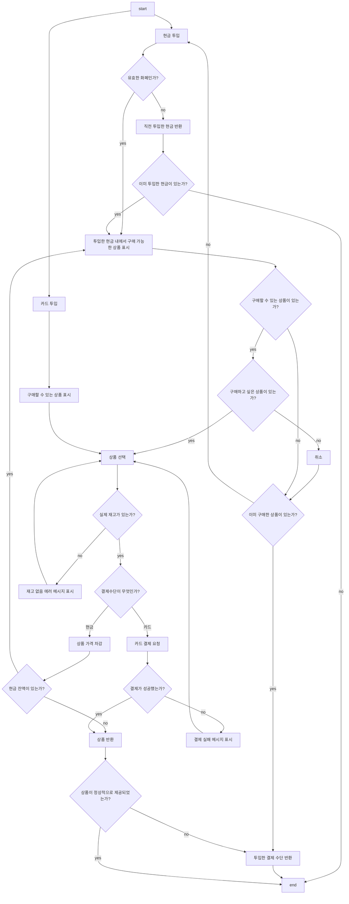

# Assignment

## Flowchart

```mermaid
flowchart TD
    start --> cash["현금 투입"]
    cash --> detectValidCash{"유효한 화폐인가?"}
    detectValidCash -- yes --> showPurchasableProduct["투입한 현금 내에서 구매 가능한 상품 표시"]
    detectValidCash -- no --> returnPreviousCash["직전 투입한 현금 반환"]
    returnPreviousCash --> hasCash{"이미 투입한 현금이 있는가?"}
    hasCash -- yes --> showPurchasableProduct
    hasCash -- no --> e["end"]
    returnAllCash["투입한 결제 수단 반환"] --> e

    showPurchasableProduct --> hasPurchasableProduct{"구매할 수 있는 상품이 있는가?"}
    hasPurchasableProduct -- yes --> hasWantedProduct{"구매하고 싶은 상품이 있는가?"}
    hasWantedProduct -- yes --> selectProduct["상품 선택"]
    hasWantedProduct -- no --> cancel["취소"]
    cancel --> alreadyHaveProduct{"이미 구매한 상품이 있는가?"}
    selectProduct --> hasStock{"실제 재고가 있는가?"}
    hasStock -- yes --> paymentMethod{"결제수단이 무엇인가?"}
    hasStock -- no --> showStockError["재고 없음 에러 메시지 표시"]
    showStockError --> selectProduct

    paymentMethod -- 현금 --> deductProductPrice["상품 가격 차감"]
    deductProductPrice --> hasCashRemaining{"현금 잔액이 있는가?"}
    hasCashRemaining -- yes --> showPurchasableProduct
    hasPurchasableProduct -- no --> alreadyHaveProduct
    alreadyHaveProduct -- no --> cash
    alreadyHaveProduct -- yes --> returnAllCash
    hasCashRemaining -- no --> outputProduct["상품 반환"]
    
    start --> card["카드 투입"]
    card --> showAvailableProduct["구매할 수 있는 상품 표시"]
    showAvailableProduct --> selectProduct
    paymentMethod -- 카드 --> payment["카드 결제 요청"]
    payment --> isPaymentSuccess{"결제가 성공했는가?"}
    isPaymentSuccess -- yes --> outputProduct
    isPaymentSuccess -- no --> showPaymentError["결제 실패 메시지 표시"]
    showPaymentError --> selectProduct

    outputProduct --> isOutputSuccess{"상품이 정상적으로 제공되었는가?"}
    isOutputSuccess -- yes --> e
    isOutputSuccess -- no --> returnAllCash
```
 
