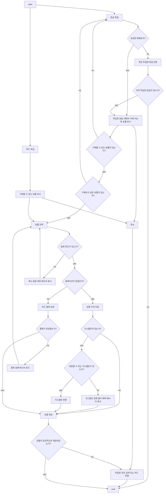

# Assignment

## Flowchart

```mermaid
flowchart TD
    start --> cash["현금 투입"]
    cash --> detectValidCash{"유효한 화폐인가?"}
    detectValidCash -- yes --> showPurcashableProduct["투입한 현금 내에서 구매 가능한 상품 표시"]
    detectValidCash -- no --> returnPreviousCash["직전 투입한 현금 반환"]
    returnPreviousCash --> hasCash{"이미 투입한 현금이 있는가?"}
    hasCash -- yes --> showPurcashableProduct
    hasCash -- no --> e["end"]
    showPurcashableProduct --> cancel["취소"]
    cancel --> returnAllCash["투입한 모든 금액 또는 카드 반환"]
    returnAllCash --> e

    showPurcashableProduct --> hasPurcashableProduct{"구매할 수 있는 상품이 있는가?"}
    hasPurcashableProduct -- no --> cash
    hasPurcashableProduct -- yes --> hasWantedProduct{"구매하고 싶은 상품이 있는가?"}
    hasWantedProduct -- yes --> selectProduct["상품 선택"]
    hasWantedProduct -- no --> cash
    selectProduct --> hasStock{"실제 재고가 있는가?"}
    hasStock -- yes --> isCash{"결제수단이 현금인가?"}
    hasStock -- no --> showStockError["재고 없음 에러 메시지 표시"]
    showStockError --> selectProduct

    isCash -- yes --> deductProductPrice["상품 가격 차감"]
    deductProductPrice --> hasChangeAmount{"거스름돈이 있는가?"}
    hasChangeAmount -- yes --> hasChangeCash{"반환할 수 있는 거스름돈이 있는가?"}
    hasChangeCash -- yes --> returnChangeAmount["거스름돈 반환"]
    hasChangeCash -- no --> showChangeCashError["거스름돈 반환 불가 에러 메시지 표시"]
    hasChangeAmount -- no --> outputProduct["상품 제공"]
    showChangeCashError --> outputProduct
    returnChangeAmount --> outputProduct
    
    start --> card["카드 투입"]
    card --> showAvailableProduct["구매할 수 있는 상품 표시"]
    showAvailableProduct --> selectProduct
    showAvailableProduct --> cancel
    isCash -- no --> payment["카드 결제 요청"]
    payment --> isPaymentSuccess{"결제가 성공했는가?"}
    isPaymentSuccess -- yes --> outputProduct
    isPaymentSuccess -- no --> showPaymentError["결제 실패 메시지 표시"]
    showPaymentError --> selectProduct

    outputProduct --> isOutputSuccess{"상품이 정상적으로 제공되었는가?"}
    isOutputSuccess -- yes --> e
    isOutputSuccess -- no --> returnAllCash
```
 
